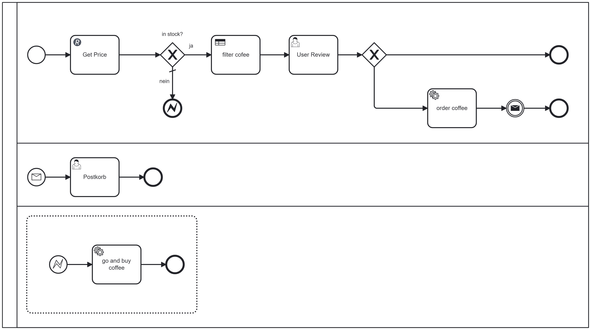

# Camunda 8 Coding Dojo

## 1 - Rest Connector

Vorwort:

Kurz Zusammenfassung Camunda 7 vs. Camunda 8:

| **Camunda 7** | **Camunda 8** |
| :--- | :--- |
| Monolith | Cloud, Microservices (vertikal skalierbar: Resourcen erhöhen) |

| **Doing** | **Beschreibung \/ Schritte** |
| :--- | :--- |
| Zeebe-Prozess-Engine | Für die Verarbeitung und das Ausführen von Workflows verantwortlich |
| Zeebe-Broker | Ist für die Verwaltung und Verteilung von Aufgaben (innerhalb des Clusters) zuständig. |
| Zeebe-Client | Ermöglicht die Interaktion mit der Zeebe-Engine.  |

Projekt-Template anschauen:

  * Dependencies
  * application.yaml

Doings:

  1. Wiremock starten
  2. Modeler starten

| **Doing** | **Beschreibung \/ Schritte** |
| :--- | :--- |
|  | - Startpunkt mit Rest Outbund Connector verbinden, Erklärung Kreise  |
|  | - Wiremock konfigurieren  Fortsetzung siehe Bild 3 |
|  |   |

## 2 - Gateway, Jobworker und Error (End&Start) Event

| **Doing** | **Beschreibung \/ Schritte** |
| :--- | :--- |
|  | Exclusive Gateway -> Default Weg, Einstick ExceptionHandling,  |
|  | Feel  Friendly Enough Expression Language soll einfach verständlich sein, sowohl für Fachler als auch entwickler |
|  | tbd |
|  | tbd |
|  | Wir implementieren unseren ersten Jobworker, kurzer Exkurs External Task Pattern -> Camunda 7, wir kommen noch später dazu was das bedeutet (Talk) |

## 3 - User Task

| **Doing** | **Beschreibung \/ Schritte** |
| :--- | :--- |
|  | Der Mitarbeiter soll entscheiden, ob Kaffee bestellt werden soll |
|  | Wir erstellen uns eine Form |
|  |  |
|  |  |

## 4 - Gateway, Jobworker

| **Doing** | **Beschreibung \/ Schritte** |
| :--- | :--- |
|  | BPMN um Gateway und Jobworker ergänzen |
|  | Die zwei Wege sind eindeutig, kein Default.  |
|  |  |
|  |  |

## 5 - Message (Throw und Start)

| **Doing** | **Beschreibung \/ Schritte** |
| :--- | :--- |
|  | Die Lanes haben keine Auswirkung |
|  | Siehe Code, Vergleich External Task in Camunda 7 -> wir kümmmern uns |
|  | tbd |
|  | tbd |

## 6 - DMN

| **Doing** | **Beschreibung \/ Schritte** |
| :--- | :--- |
|  | Beschreibung |
|  | Decision Model & Notation |
|  |  |
|  |  |
