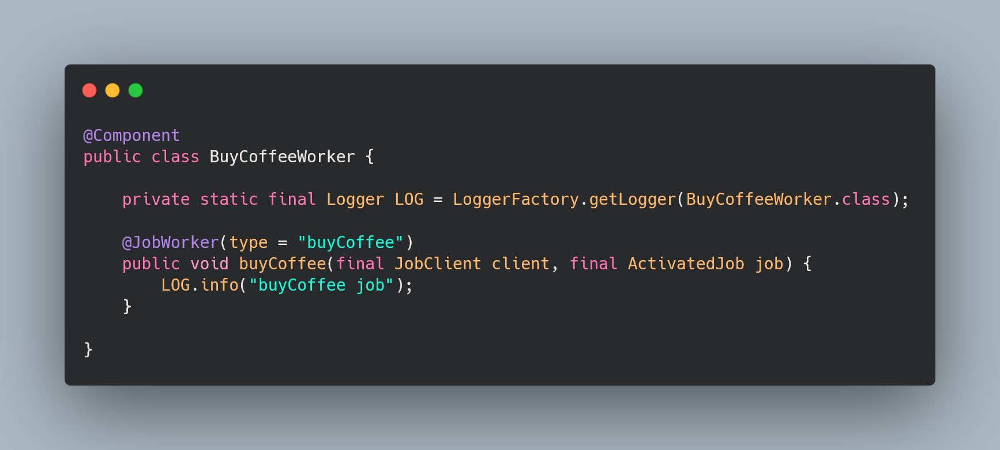

# Camunda 8 Coding Dojo

## 1 - Rest Connector

|  | Beschreibung |
|  | Beschreibung |
|  | Beschreibung |

## 2 - Gateway, Jobworker und Error (End&Start) Event

|  | Beschreibung |
|  | Beschreibung |
|  | Beschreibung |
|  | Beschreibung |
|  | Beschreibung |

## 3 - User Task

|  | Beschreibung |
|  | Beschreibung |
|  | Beschreibung |
|  | Beschreibung |

## 4 - Gateway und Jobworker

|  | Beschreibung |
|  | Beschreibung |
|  | Beschreibung |
|  | Beschreibung |

## 5 - Message (Throw und Start)

|  | Beschreibung |
|  | Beschreibung |
|  | Beschreibung |
|  | Beschreibung |

## 6 - DMN

|  | Beschreibung |
|  | Beschreibung |
|  | Beschreibung |
|  | Beschreibung |